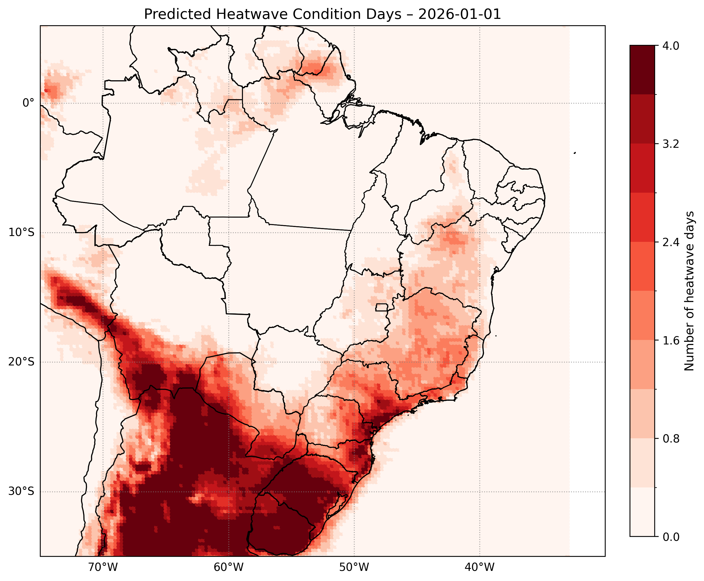

# Example Forecast Output

This document illustrates a simplified example of the system output generated by AgenticAI Heatwaves BR.

Selected forecast date:

```
2026-01-01
```

The following report represents the structured scientific output returned by the `/forecast` endpoint for the selected date.

---

## Heatwave Forecast Report

### Overview

A severe heatwave is forecasted to affect the region over the next several days, with temperatures expected to exceed the mean monthly maximum temperature by at least 5 °C, as defined by the World Meteorological Organization (WMO). This report is based on model-based forecasts and provides an overview of the expected spatial patterns and state-level highlights.

### Spatial Patterns

The map indicates potential regional hotspots in the southern and southeastern portions of the depicted area, with spatial gradients transitioning from lighter to darker shades moving from north to south. This suggests varying predicted heatwave conditions, with regions in the south experiencing more severe heatwave conditions than those in the north. The contrast between regions with lighter shading and those with darker shading highlights the potential for significant temperature differences across the region.

### State-Level Highlights

According to the state-level statistics, São Paulo (SP) is expected to experience very high heatwave severity, with a mean of 1.99 days per month exceeding the mean monthly maximum temperature by at least 5 °C during the reference period of 1961–1990. This is significantly higher than the climatological mean of 0.64 days per month, indicating a substantial increase in heatwave frequency. The 90th percentile of heatwave days (p90) is also expected to be higher than the climatological value, with a mean of 3.32 days per month, further emphasizing the severity of the forecasted heatwave.

### Scientific Context

The 1961–1990 climatological baseline provides a useful reference point for understanding the expected heatwave conditions. This period is characterized by a relatively stable climate, allowing for a more accurate assessment of heatwave frequency and severity. The WMO definition of heatwaves, which considers daily maximum temperatures exceeding the mean monthly maximum temperature by at least 5 °C, is used to determine the severity of the forecasted heatwave.

### Limitations

It is essential to note that this report is based on model-based forecasts, which inherently involve some level of uncertainty. While the models used are state-of-the-art and well-validated, there is always a degree of uncertainty associated with predicting complex weather phenomena. Therefore, the results presented in this report should be interpreted with caution, and users are advised to consider multiple sources of information when making decisions related to the forecasted heatwave.


---

## Notes on Simplification

For demonstration purposes:

- Only the state of São Paulo (SP) is explicitly described in the “State-Level Highlights” section.
- The full state-level JSON statistics were not included here because inserting the complete structured output would exceed the free token limits of the Hugging Face inference API used during development.
- In the operational system, the PNG map is returned as a base64-encoded image by the API and rendered in the Streamlit frontend.

This example is intended to illustrate the structure and style of the generated report, not to provide a complete operational output.